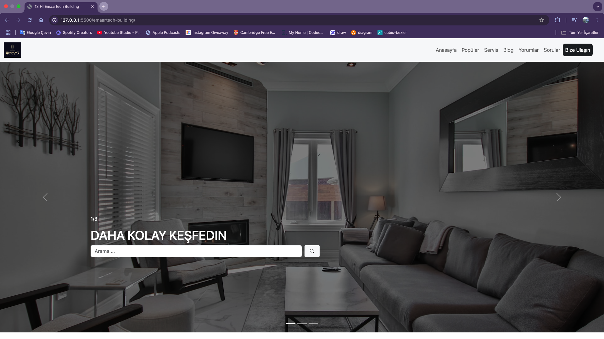
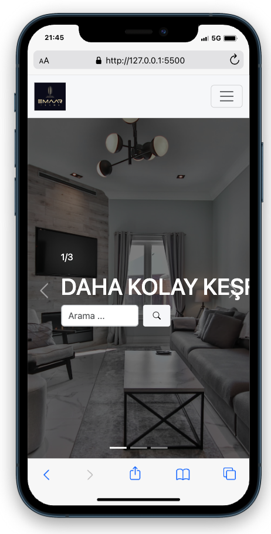

# Emaar-Tech Building

Bu proje, modern bir yapı ve inşaat şirketi arayüzü olan **Emaar-Tech Building** projesidir. **HTML, CSS ve Bootstrap** kullanılarak oluşturulmuş olup **responsive** tasarıma sahiptir.

## ✨ Özellikler
- **Responsive Tasarım**: Mobil, tablet ve masaüstü cihazlarla uyumludur.
- **Modern UI/UX**: Kurumsal ve profesyonel bir arayüz.
- **Bootstrap ile Hızlı Geliştirme**: Grid sistemi ve hazır bileşenler kullanıldı.
- **Duyarlı Navigasyon Menüsü**: Küçük ekranlarda otomatik olarak uyum sağlar.

## 📚 Kullanılan Teknolojiler
- **HTML5**
- **CSS3**
- **Bootstrap 5**

## ✨ Kurulum
Projeyi çalıştırmak için aşağıdaki adımları takip edebilirsiniz:

1. Bu repoyu klonlayın:
   ```bash
   git clone https://github.com/kullanici-adin/emaar-tech-building.git
   ```
2. Proje klasörüne gidin:
   ```bash
   cd emaar-tech-building
   ```
3. `index.html` dosyasını tarayıcınızda açın.

## 🚀 Ekran Görüntüleri




## 👤 Katkıda Bulunma
Projeye katkıda bulunmak isterseniz **pull request** açabilirsiniz.

## 🌐 Canlı Önizleme


---
_Bu proje, yalnızca eğitim amaçlı geliştirilmiştir ve ticari bir amacı yoktur._

